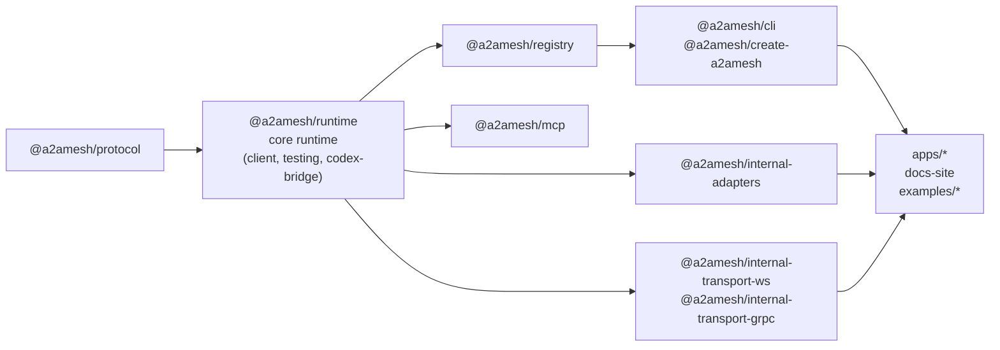
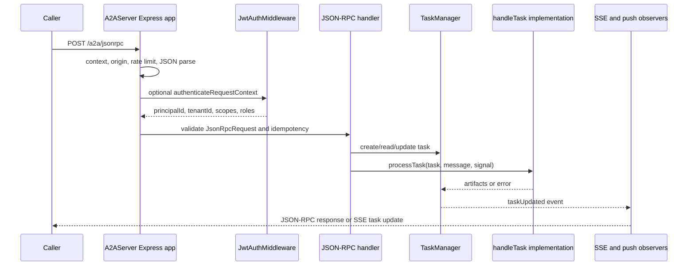
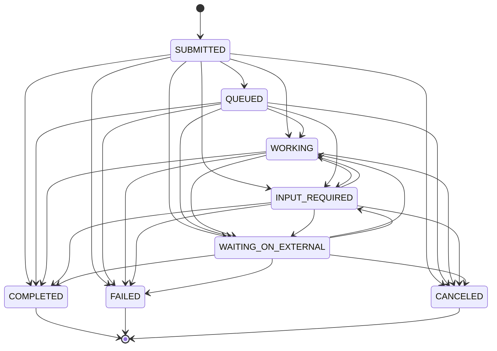
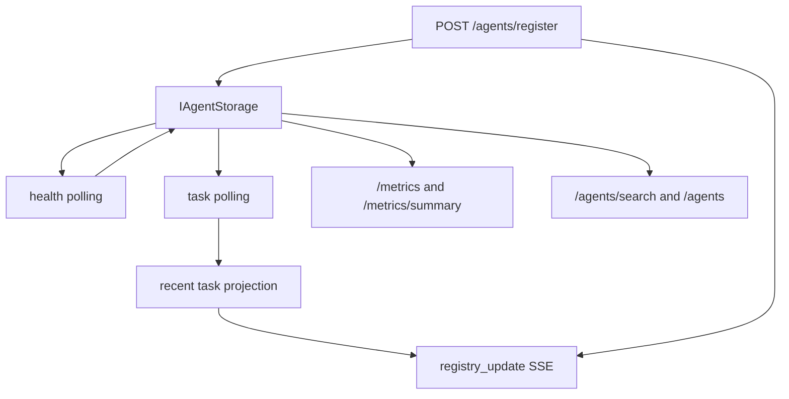

# Architecture

This document is the canonical architecture map for A2A Mesh. It covers the
workspace dependency graph, runtime request flow, task lifecycle, storage model,
outbound network policy, authentication, telemetry, registry runtime, release flow,
and the checks that keep those boundaries from drifting.

The Mermaid blocks in this file are the source-controlled diagram source for the
architecture. Keep them in sync with the package graph and request flow when those
surfaces change.

## Layered Map

The monorepo is organized so package dependencies flow from protocol data shapes
toward user-facing command and app surfaces.

```text
types/schemas -> core runtime -> transports -> client/registry -> adapters/bridges -> CLI/apps
```



The graph is deliberately conservative. `packages/runtime` owns protocol types,
schemas, server/client primitives, auth, storage, telemetry, and network policy.
Everything else consumes that public API instead of importing runtime internals.

## Package Responsibilities

| Workspace package or surface       | Responsibility                                                                                                                                                                                                                                                                                                                                              |
| ---------------------------------- | ----------------------------------------------------------------------------------------------------------------------------------------------------------------------------------------------------------------------------------------------------------------------------------------------------------------------------------------------------------- |
| `@a2amesh/runtime`                 | Core package. Owns Agent2Agent protocol types, public schemas, `A2AServer`, `A2AClient`, `AgentRegistryClient`, `TaskManager`, `AsyncTaskManager`, auth middleware, task storage, URL policy, telemetry, rate limiting, idempotency, agent card signing, standalone client re-exports, test fixtures and conformance helpers, and Codex-style tool bridges. |
| `@a2amesh/registry`                | Registry service for agent registration, discovery, tenant-aware listing, health polling, task projection, registry metrics, REST routes, and SSE event streams.                                                                                                                                                                                            |
| `@a2amesh/internal-adapters`       | Adapter package for provider and framework integrations. Adapters implement the public runtime task contract and keep provider SDKs optional where possible.                                                                                                                                                                                                |
| `@a2amesh/internal-transport-ws`   | WebSocket transport helpers and transport-contract coverage for A2A runtime calls over `ws`.                                                                                                                                                                                                                                                                |
| `@a2amesh/internal-transport-grpc` | gRPC transport helpers and transport-contract coverage for A2A runtime calls over `@grpc/grpc-js`.                                                                                                                                                                                                                                                          |
| `@a2amesh/mcp`                     | Mapping helpers between A2A agents and MCP tool/skill descriptions. It may use core/client public APIs and MCP SDK types.                                                                                                                                                                                                                                   |
| `@a2amesh/protocol`                | Standalone JSON Schema package for editor, CI, and validation pipelines.                                                                                                                                                                                                                                                                                    |
| `@a2amesh/cli`                     | Command-line interface for validation, discovery, send, task, registry, conformance, benchmark, health, monitor, doctor, export-card, and scaffold commands.                                                                                                                                                                                                |
| `@a2amesh/create-a2amesh`          | Project scaffolder that renders CLI-owned templates and runtime version metadata.                                                                                                                                                                                                                                                                           |
| `a2amesh-demo`                     | Local multi-agent demo app that consumes runtime, registry, and adapters.                                                                                                                                                                                                                                                                                   |
| `a2amesh-registry-ui`              | Registry UI app that consumes registry REST/SSE endpoints through fetch and EventSource mocks in tests.                                                                                                                                                                                                                                                     |
| `docs-site`                        | VitePress documentation site that mirrors canonical topics from `docs/`.                                                                                                                                                                                                                                                                                    |
| `examples/*`                       | Local, no-paid-service examples for authenticated server, streaming, push notifications, registry tenancy, WebSocket, gRPC, MCP bridge, and adapter templates.                                                                                                                                                                                              |

## Dependency Direction

The hard boundary is enforced by `scripts/check-workspace-graph.mjs`.

| Owner               | Must not import                                               |
| ------------------- | ------------------------------------------------------------- |
| `packages/runtime`  | adapters, registry, CLI, MCP bridge, WebSocket, gRPC, schemas |
| `packages/registry` | adapters, CLI, MCP bridge, schemas                            |
| `packages/adapters` | registry, CLI, MCP bridge, schemas                            |
| `packages/mcp`      | registry, adapters, CLI, schemas                              |
| `packages/protocol` | core, adapters, registry, CLI, MCP bridge, WebSocket, gRPC    |

Allowed dependencies still need to use public package entry points. Deep imports across
package boundaries are treated as design drift unless the package explicitly exports that
surface and the public surface inventory is updated in the same change.

## Request Lifecycle

`A2AServer` builds an Express app around a single agent card and a task manager. Startup
wires middleware before routes:

1. Create an anonymous request context.
2. Apply origin guard and rate limiting.
3. Parse JSON with the configured body limit.
4. Serve agent cards from `/.well-known/agent-card.json` and `/.well-known/agent.json`.
5. Serve `/health`, `/metrics`, `/tasks`, JSON-RPC POST paths, and SSE stream paths.



Task ownership checks run after authentication for task reads, cancellation, push
notification configuration, task listing, and streaming. If auth is configured or a
non-anonymous request context exists, task visibility is default-deny: the request context
must include both `principalId` and `tenantId`, the task must include both owner fields,
and both values must match exactly. Legacy or imported tasks without complete ownership
metadata are hidden from authenticated task lists and rejected for direct task access.

## JSON-RPC Flow

The HTTP JSON-RPC handler rejects batch requests, validates the JSON-RPC envelope, applies
optional auth, resolves idempotency, and dispatches to the method-specific handler. The
stable method surface is:

| Method                            | Runtime path                                                                                                                                                                                                |
| --------------------------------- | ----------------------------------------------------------------------------------------------------------------------------------------------------------------------------------------------------------- |
| `message/send`                    | Creates or resumes a task, normalizes the message, negotiates extensions, optionally stores push notification config, moves the task to `WORKING`, starts adapter processing, and returns the current task. |
| `message/stream`                  | Uses the same task creation path as `message/send`, then keeps a JSON-RPC SSE response open until the task reaches a terminal state.                                                                        |
| `tasks/resubscribe`               | Re-attaches an SSE JSON-RPC response to an existing accessible task.                                                                                                                                        |
| `tasks/get`                       | Reads one accessible task by `taskId`.                                                                                                                                                                      |
| `tasks/cancel`                    | Moves an accessible task to `CANCELED`.                                                                                                                                                                     |
| `tasks/list`                      | Lists accessible tasks, optionally filtered by `contextId`, with `limit` and `offset`.                                                                                                                      |
| `tasks/pushNotification/set`      | Validates and stores an accessible task's callback config after outbound URL policy checks.                                                                                                                 |
| `tasks/pushNotification/get`      | Reads an accessible task's callback config.                                                                                                                                                                 |
| `agent/authenticatedExtendedCard` | Returns the full card only when the agent card advertises `extendedAgentCard`.                                                                                                                              |

JSON-RPC error normalization maps lifecycle failures into protocol errors. Unknown
internal failures are logged and returned as `Internal Error`.

## Task Lifecycle

Task mutation rules live in `packages/runtime/src/server/taskLifecycle.ts` and are used by
both `TaskManager` and `AsyncTaskManager`.



`COMPLETED`, `FAILED`, and `CANCELED` are terminal. Terminal tasks reject additional
history messages, artifacts, push notification changes, and state transitions. Entering
`WORKING` records `startedAt` if it is not already present. Entering a terminal state
records `endedAt`, state-specific metadata, and `durationMs` when timestamps are valid.

## Storage Model

The runtime has synchronous and async task storage contracts:

| Storage surface          | Use                                                                               |
| ------------------------ | --------------------------------------------------------------------------------- |
| `ITaskStorage`           | Synchronous task storage interface used by `TaskManager`.                         |
| `InMemoryTaskStorage`    | Default local storage for `A2AServer`.                                            |
| `SqliteTaskStorage`      | Optional local durable task storage loaded only when constructed by the consumer. |
| `AsyncTaskStorage`       | Async storage interface used by `AsyncTaskManager`.                               |
| `SyncTaskStorageAdapter` | Adapter that wraps `ITaskStorage` for async manager usage.                        |

Registry storage is separate:

| Registry storage  | Use                                                                                                           |
| ----------------- | ------------------------------------------------------------------------------------------------------------- |
| `IAgentStorage`   | Async registry storage contract for registered agents, list queries, summaries, deletion, and status updates. |
| `InMemoryStorage` | Default registry storage for local and test flows.                                                            |
| `RedisStorage`    | Optional registry storage backend with index helpers in `storage/indexing.ts`.                                |

Runtime task storage records task bodies, context IDs, owner metadata, push notification
config, and TTL hooks where a backend supports TTL. Registry storage records agent URL,
normalized agent card, tags, skills, status, tenant ID, public visibility, heartbeat, and
health metadata.

## Registry Runtime

`RegistryServer` is an Express REST/SSE service with its own context object. It wires CORS,
anonymous context, origin checks, rate limiting, JSON parsing, auth, metrics, polling,
task projection, and registry routes.



Control-plane routes authenticate through registry auth when private or tenant-scoped data
is requested. Public listing is available only for agents marked `isPublic`. Tenant-aware
queries include public agents when appropriate and filter private agents by request context.

Health polling calls each registered agent's `/health` endpoint with bounded concurrency,
jitter, timeout, and the shared outbound policy. Task polling calls `/tasks?limit=20`,
validates a safe task shape, and emits task projection events when a task version changes.

## Outbound Network Policy

All remote fetch and callback paths use the core outbound policy helpers:

- `validateUrl` parses the URL, validates the scheme, resolves hostnames when needed, and
  applies safe URL checks.
- `validateAndFetch` runs `validateUrl`, then `fetchWithPolicy` for timeout, retry,
  backoff, jitter, abort signal, and telemetry labels.
- `JwtAuthMiddleware` uses the policy for OIDC discovery and JWKS fetches.
- `PushNotificationService` and push notification config normalization use the policy for
  callback URLs.
- Registry registration, import, health polling, and task polling use the same policy.

Localhost is allowed by default only outside `NODE_ENV=production` unless the caller
overrides the policy. Private networks and unresolved hostnames are denied by default.
Allowed hostnames, allowed schemes, DNS cache TTL, timeout, retry, and backoff controls are
explicit options.

## Auth Model

`JwtAuthMiddleware` supports API keys, HTTP bearer JWTs, and OIDC discovery with JWKS. It
returns a request context containing `authMethod`, `principalId`, optional `tenantId`,
scopes, roles, and claims.

Auth decisions are used in two layers:

- Request authentication rejects unauthenticated JSON-RPC, stream, task-list, registry, or
  control-plane calls when auth is configured for that surface.
- Ownership checks compare request context to task or agent metadata before returning,
  streaming, canceling, or mutating a resource.

API key comparison uses timing-safe comparison after normalizing configured credentials.
JWT validation uses configured issuer, audience, and algorithm constraints. OIDC discovery
and JWKS fetches go through the outbound policy before token verification.

## Telemetry Model

The runtime has stable trace and metric names documented in
[Observability](observability.md). `RuntimeMetrics` records task counters, auth rejects,
SSE counters, active SSE gauge values, and task duration histograms. It renders Prometheus
text through `/metrics` and also records instruments through OpenTelemetry when a meter
provider is installed.

Trace flow:

- `a2a.handleRpc` wraps JSON-RPC dispatch and records method and agent name.
- `a2a.processTask` wraps adapter task execution and records task/context IDs.
- `http.request` wraps outbound fetch policy calls with retry and status attributes.

Registry metrics are rendered from registry state through `/metrics` and
`/metrics/summary`. They track registrations, searches, heartbeats, agent count, healthy
agent count, active tenants, and public agents.

## Release Flow

Release responsibilities are intentionally split:

1. Ordinary changes merge through pull requests after local verification and CI.
2. Release Please proposes version and changelog updates.
3. Owners verify the release candidate with `pnpm run verify`.
4. Owner-triggered publish workflow packs packages, smoke-installs tarballs, writes
   checksums, emits the CycloneDX SBOM, creates artifact attestations, and publishes to npm
   through Trusted Publishing/OIDC.

Normal CI must not publish npm packages, create tags, create GitHub Releases, or push
container images. The release process is documented in [Release Process](../release/process.md).

## Workspace Graph Gate

Run the graph gate directly when changing package boundaries:

```bash
node scripts/check-workspace-graph.mjs
node scripts/check-workspace-graph.mjs --summary
```

Current summary output:

```text
Workspace graph validation passed.
Checked 8 public package import aliases across 36 forbidden dependency edges.
Dependency direction: types/schemas -> core runtime -> transports -> registry -> adapters/bridges -> CLI/apps.
```

`pnpm run verify:structure` runs this graph gate together with public surface, command
surface, and release config checks.

## Tests And ADRs

Architecture changes should link the nearest test or ADR that protects the behavior:

- [ADR index](../architecture/adr/index.md)
- [ADR-0001: Prettier formatter authority](../architecture/adr/0001-prettier-formatter.md)
- [ADR-0002: Garbage collection allowlist](../architecture/adr/0002-gc-allowlist.md)
- [ADR-0003: Coverage baseline](../architecture/adr/0003-coverage-baseline.md)
- [ADR-0004: Storage semantics](../architecture/adr/0004-storage-semantics.md)
- [ADR-0005: Transport contracts](../architecture/adr/0005-transport-contracts.md)
- [ADR-0006: Outbound network policy](../architecture/adr/0006-outbound-network-policy.md)
- [ADR-0007: Release provenance](../architecture/adr/0007-release-provenance.md)
- [ADR-0008: Protocol conformance versioning](../architecture/adr/0008-protocol-conformance-versioning.md)
- [Client/server integration](../../tests/integration/client-server.test.ts)
- [Protocol conformance tests](../../tests/conformance/a2a-conformance.test.ts)
- [Transport contract helper](../../tests/transport-contract/transportContract.ts)
- [HTTP/SSE transport contract tests](../../tests/transport-contract/http-sse.test.ts)
- [WebSocket transport contract tests](../../packages/transport-ws/tests/transport-contract.test.ts)
- [gRPC transport contract tests](../../packages/transport-grpc/tests/transport-contract.test.ts)
- [Task lifecycle property tests](../../packages/runtime/tests/properties/task-lifecycle.property.test.ts)
- [Outbound URL policy property tests](../../packages/runtime/tests/properties/url-policy.property.test.ts)
- [Registry storage tests](../../packages/registry/tests/storage.test.ts)
- [Registry Redis storage tests](../../packages/registry/tests/redis-storage.test.ts)
- [Adapter contract tests](../../packages/adapters/tests/contract.test.ts)
- [Telemetry snapshot tests](../../packages/runtime/tests/telemetry-snapshots.test.ts)
- [Registry metrics snapshot tests](../../packages/registry/tests/metrics-snapshots.test.ts)
- [Release artifact tests](../../tests/integration/release-artifacts.test.ts)
