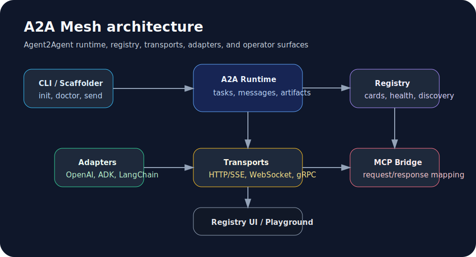

# A2A Mesh Documentation

A2A Mesh is an independent TypeScript runtime and toolkit for the Agent2Agent
(A2A) protocol. It is not an official Google, Linux Foundation, or a2aproject
package.

## Why A2A Mesh?

A2A Mesh gives TypeScript teams one place for runtime primitives, client calls,
Agent Card validation, registry discovery, adapters, MCP bridge mapping,
transports, CLI diagnostics, and release-ready conformance output.

Use it when you want a working local A2A development loop plus production checks
instead of a collection of disconnected scripts.

## First-run path

1. Install or scaffold a project with [Install](install.md) and
   [Quickstart](quickstart.md).
2. Run the [5-minute demo](demo.md) to validate a local Agent Card and send a
   task.
3. Review the [architecture overview](development/architecture.md) and package
   boundaries before extending runtime code.
4. Use the [production checklist](production-checklist.md) before exposing a
   runtime, registry, or bridge to shared environments.

## Choose the right docs

- [Install](install.md)
- [Quickstart](quickstart.md)
- [5-minute demo](demo.md)
- [Examples](examples.md)
- [Compatibility](compatibility.md)
- [Protocol compatibility](protocol/compatibility.md)
- [JSON Schemas](protocol/schemas.md)
- [Architecture](development/architecture.md)
- [Production checklist](production-checklist.md)
- [Official SDKs vs A2A Mesh](sdk-comparison.md)
- [Observability](development/observability.md)
- [Threat model](security/threat-model.md)
- [Registry UI](../apps/registry-ui/README.md)
- [Release process](release/process.md)
- [Fleet Roadmap](fleet/roadmap.md)
- [Fleet Package Map](fleet/package-map.md)
